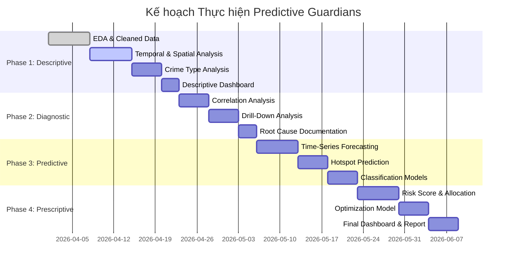

# 📋 Kế hoạch Thực hiện — Predictive Guardians

> **Tags:** #ke-hoach #analytics #4-loai
> **Cập nhật lần cuối:** 2026-04-10
> **Trạng thái:** ✅ Hoàn thành

---

## 🎯 Bài toán Nghiệp vụ (Business Problem)

> **"Làm thế nào để phân bổ lực lượng cảnh sát một cách tối ưu, dựa trên dự báo tội phạm theo thời gian và không gian, nhằm giảm thiểu tội phạm và tối đa hóa tỷ lệ phá án?"**

### Các câu hỏi nghiệp vụ phái sinh:
1. Tội phạm tập trung ở đâu, vào thời điểm nào?
2. Nguyên nhân gốc rễ nào dẫn đến gia tăng tội phạm?
3. Vụ án nào có nguy cơ tái phạm cao?
4. Cần phân bổ bao nhiêu cảnh sát cho từng khu vực?

---

## 🏗️ Kiến trúc Phân tích (4 Levels)

```
DESCRIPTIVE  →  DIAGNOSTIC  →  PREDICTIVE  →  PRESCRIPTIVE
"Chuyện gì    "Tại sao       "Chuyện gì    "Chúng ta cần
 đã xảy ra?"   xảy ra?"       sẽ xảy ra?"   làm gì?"
```

---

## 📊 Phase 1: DESCRIPTIVE ANALYTICS (Phân tích Mô tả)

> **Trả lời:** *Chuyện gì đã xảy ra với tội phạm ở Karnataka?*
> **Trạng thái:** ✅ Hoàn thành

### 1.1 Phân tích Xu hướng Thời gian
- [ ] Biểu đồ số vụ án theo **năm** (2016–2024) → nhận định xu hướng tổng thể
- [ ] Biểu đồ số vụ án theo **tháng** (seasonality — tháng nào cao nhất/thấp nhất)
- [ ] Biểu đồ số vụ án theo **ngày trong tuần** (heatmap)
- [ ] So sánh trước/trong/sau COVID-19 (2019 vs 2020 vs 2021)

**Output:** Time-series chart, heatmap theo tháng/ngày

### 1.2 Phân tích Địa lý (Spatial)
- [ ] **Choropleth Map** phân bổ tội phạm theo quận (top 41 districts)
- [ ] **Bar chart** top 10 quận nhiều vụ án nhất
- [ ] Phân bố tội phạm theo Beat (khu tuần tra)
- [ ] So sánh đô thị (Bengaluru) vs nông thôn

**Output:** Map, bar charts, phân tích tập trung tội phạm

### 1.3 Phân tích Loại Tội phạm
- [ ] Treemap/Pie chart phân bổ CrimeGroup_Name
- [ ] Top 15 nhóm tội phạm phổ biến nhất
- [ ] Phân tích **FIR Type**: Heinous (11.5%) vs Non-Heinous (88.5%)
- [ ] Phân tích **Complaint Mode**: Written vs Online vs Sue-moto

**Output:** Treemap, word cloud, frequency charts

### 1.4 Phân tích Nạn nhân & Bị can
- [ ] Phân bổ nạn nhân theo giới tính (Male/Female/Boy/Girl)
- [ ] Tỷ lệ bắt giữ (Arrested Count / Accused Count)
- [ ] Tỷ lệ kết án (Conviction Count / Accused Count)
- [ ] Phân tích FIR_Stage distribution (Pending Trial, Convicted, Undetected...)

**Output:** Demographics charts, funnel chart của process điều tra

### 1.5 Dashboard Descriptive
- [ ] Tạo **Power BI / Streamlit Dashboard** tổng hợp tất cả

**Deliverable:** [[10 - Descriptive Analytics]]

---

## 🔍 Phase 2: DIAGNOSTIC ANALYTICS (Phân tích Chẩn đoán)

> **Trả lời:** *Tại sao tội phạm lại tập trung ở những nơi/thời gian đó?*
> **Trạng thái:** ✅ Hoàn thành

### 2.1 Phân tích Tương quan (Correlation Analysis)
- [ ] Tương quan giữa **loại tội phạm** và **quận/khu vực** (Cramér's V cho categorical)
- [ ] Tương quan giữa **thời điểm trong năm** và **nhóm tội phạm** cụ thể
- [ ] Tương quan giữa **Offence_Duration** và loại tội phạm (instant crime vs prolonged)
- [ ] Phân tích **khoảng cách tới đồn cảnh sát** và tỷ lệ phát hiện

### 2.2 Drill-Down vào Các Pattern Bất thường
- [ ] **Tại sao Bengaluru City chiếm 25.4% số vụ án?** — Phân tích mật độ dân số, số đồn cảnh sát
- [ ] **Tại sao Cyber Crime tăng mạnh?** — Trend theo năm
- [ ] **Tại sao số vụ Theft cao nhất?** — Phân tích giờ, khu vực cụ thể
- [ ] **Vì sao 29.8% vụ án không phá được (Undetected)?** — Drill-down theo quận, loại tội

### 2.3 Phân tích Nguyên nhân Xã hội học
- [ ] (Liên kết dữ liệu Criminal Profiling) Mối liên hệ nghề nghiệp → loại tội phạm
- [ ] Phân tích tội phạm có liên quan đến yếu tố kinh tế - xã hội

### 2.4 Root Cause Analysis cho 3 Crime Patterns
- [ ] **Pattern 1:** Tội phạm giao thông (Motor Vehicle Accidents) — nguyên nhân gì?
- [ ] **Pattern 2:** Molestation & Cyber Crime — xu hướng số hóa
- [ ] **Pattern 3:** Missing Person — phân tích theo nhân khẩu học

**Deliverable:** [[20 - Diagnostic Analytics]]

---

## 🔮 Phase 3: PREDICTIVE ANALYTICS (Phân tích Dự đoán)

> **Trả lời:** *Chuyện gì sẽ xảy ra trong tương lai?*
> **Trạng thái:** ✅ Hoàn thành

### 3.1 Time-Series Forecasting — Dự báo số vụ án
- [ ] **Prophet / SARIMA** dự báo số vụ án theo tháng cho từng quận (12 tháng tới)
- [ ] Dự báo theo từng **nhóm tội phạm** lớn
- [ ] Phát hiện **anomaly** (tháng nào có số vụ bất thường cao/thấp)
- [ ] Mô hình: `CrimeGroup × District × Month → Predicted Crime Count`

**Mô hình đề xuất:** Facebook Prophet (seasonal decomposition) hoặc SARIMA

### 3.2 Hotspot Prediction — Dự báo Vị trí Hotspot
- [ ] **DBSCAN / KDE** clustering phân cụm hotspot tội phạm theo Beat
- [ ] Phân loại Beat theo mức độ rủi ro: High / Medium / Low risk zone
- [ ] Dự báo beat nào sẽ "leo thang" tội phạm trong 3-6 tháng tới

**Mô hình đề xuất:** Kernel Density Estimation + gradient analysis

### 3.3 Crime Severity Classification
- [ ] Xây dựng model phân loại FIR Type (Heinous/Non-Heinous) dựa trên features có sẵn
- [ ] Features: CrimeGroup, District, Month, Complaint_Mode, Beat_Name
- [ ] **Random Forest / XGBoost** classifier
- [ ] **Mục đích:** Ưu tiên phân bổ nguồn lực cho khu vực có crime severity cao

**Metric:** Precision, Recall, F1-score (Heinous class)

### 3.4 Case Resolution Prediction — Dự báo khả năng Phá án
- [ ] Dự báo xem vụ án có khả năng bị **Undetected** không
- [ ] Features: CrimeGroup, District, IOName/IO_workload, Complaint_Mode
- [ ] **Logistic Regression / Gradient Boosting**
- [ ] **Mục đích:** Cảnh báo sớm cho vụ án có nguy cơ không phá được

**Deliverable:** [[30 - Predictive Analytics]]

---

## 🎯 Phase 4: PRESCRIPTIVE ANALYTICS (Phân tích Đề xuất)

> **Trả lời:** *Chúng ta cần làm gì để tối ưu hóa nguồn lực?*
> **Trạng thái:** ✅ Hoàn thành

### 4.1 Resource Allocation Optimization
- [ ] Xây dựng **điểm rủi ro tổng hợp** (Composite Risk Score) cho từng Beat:
  - `Risk Score = f(Crime Volume, Crime Severity, Detection Rate, Population)`
- [ ] **Phân hạng Beat** theo mức ưu tiên phân bổ cảnh sát
- [ ] So sánh **Sanctioned Strength hiện tại** vs **Recommended Strength** (từ model)
- [ ] Đề xuất điều chuyển / bổ sung nhân sự cụ thể

**Output:** Bảng khuyến nghị phân bổ cảnh sát theo Beat/District

### 4.2 Patrol Scheduling Optimization
- [ ] Xác định **khung giờ cao điểm** tội phạm theo loại crime (sử dụng FIR_Month + FIR_Day)
- [ ] Đề xuất lịch tuần tra tối ưu theo **mùa và ngày trong tuần**
- [ ] Mô hình hóa: *Bao nhiêu cảnh sát cần có mặt tại Beat X vào thời điểm T?*

**Phương pháp:** Linear Programming (LP) / Integer Programming (IP)

### 4.3 Prevention Strategy Recommendations
- [ ] **Chiến lược theo loại crime:**
  - Cyber Crime → Đề xuất tập huấn kỹ năng số cho cộng đồng
  - Theft/Burglary → Đề xuất lắp đặt camera, chiếu sáng công cộng
  - Motor Vehicle Accidents → Tăng cường checkpoint
  - Crimes against Women → Patrol đêm, hotline
- [ ] Ưu tiên chiến lược theo ROI (giảm crime nhiều nhất với nguồn lực ít nhất)

### 4.4 Decision Support Dashboard
- [ ] Dashboard tương tác cho **Police Commander** cấp quận:
  - Nhập: Ngân sách nhân sự hiện tại
  - Output: Phân bổ tối ưu theo Beat + lịch tuần tra
- [ ] Kịch bản what-if: "Nếu tôi tăng thêm 10 cảnh sát, nên bổ sung vào Beat nào?"

**Deliverable:** [[40 - Prescriptive Analytics]]

---

## 📅 Timeline Thực hiện



---

## 🛠️ Tech Stack

| Công cụ | Mục đích |
|---|---|
| **Python (pandas, numpy)** | EDA, data cleansing |
| **Matplotlib / Seaborn / Plotly** | Visualization |
| **scikit-learn** | Classification, clustering |
| **Facebook Prophet / statsmodels** | Time-series forecasting |
| **H2O AutoML** | Recidivism & severity prediction |
| **PuLP / SciPy** | Linear programming (resource allocation) |
| **Power BI / Streamlit** | Dashboard |
| **Obsidian** | Ghi chú & quản lý tiến độ |

---

## 📁 Cấu trúc File Phân tích

```
crime_BA/
├── crime-ba/                    ← Obsidian vault
│   ├── 00 - Home.md
│   ├── 01 - Ke hoach thuc hien.md
│   ├── 02 - Metadata Dataset.md
│   ├── 10 - Descriptive Analytics.md
│   ├── 20 - Diagnostic Analytics.md
│   ├── 30 - Predictive Analytics.md
│   ├── 40 - Prescriptive Analytics.md
│   └── 90 - Progress Log.md
├── dataset/
│   └── FIR_Details_Data.csv
├── Crime_Pattern_Analysis/
├── Predictive_Modeling/
├── Resource_Allocation/
└── app/
```

---

## 🔗 Liên kết

- [[00 - Home|← Home]]
- [[02 - Metadata Dataset|📂 Metadata Dataset]]
- [[10 - Descriptive Analytics|→ Phase 1: Descriptive]]
- [[20 - Diagnostic Analytics|→ Phase 2: Diagnostic]]
- [[30 - Predictive Analytics|→ Phase 3: Predictive]]
- [[40 - Prescriptive Analytics|→ Phase 4: Prescriptive]]
